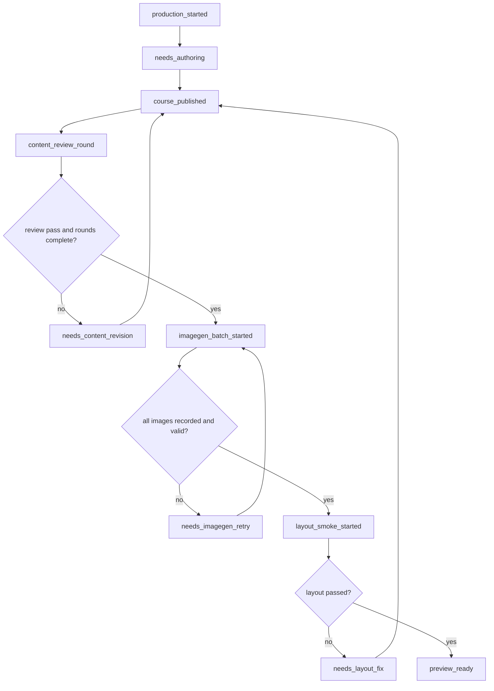

# One-Shot Course Production Pipeline Implementation Plan

> **For agentic workers:** REQUIRED SUB-SKILL: Use superpowers:subagent-driven-development (recommended) or superpowers:executing-plans to implement this plan task-by-task. Steps use checkbox (`- [ ]`) syntax for tracking.

**Goal:** 把“自然语言学习需求 -> 内容审核 -> imagegen 批处理 -> layout smoke -> 可预览课程包”收敛成一个默认生产流水线，解决端到端自动化、内容质量稳定性、imagegen 批量生产三个 gap。

**Architecture:** 新增一个 learner-facing production pipeline 状态机，复用现有 `ContentReviewService`、`ImagegenAssetBatchService`、`PreviewLayoutSmokeService`，把中间 artifacts 隐藏为内部证据，只向 Codex/Claude 返回下一步明确动作。MCP 继续负责文件、状态、质量门禁和报告；Codex/Claude 继续负责内容创作、批判性修订和调用 imagegen 生成图片。

**Tech Stack:** TypeScript、Vitest、MCP runtime tools、现有 Vite preview、Playwright layout smoke、Codex skills。

---

## 产品目标

本计划一次性解决 3 个 gap：

1. **Gap 1：端到端自动化不顺滑**  
   用户通过 Codex/Claude 用自然语言说明学习目标后，系统应最多只问 1 轮澄清问题，然后自动执行生产流水线。用户不需要审批 source graph、course plan、review brief、image manifest、layout report 等中间 artifacts。

2. **Gap 2：内容质量依赖 Codex 执行质量**  
   系统必须把三轮内容审核变成默认出口门禁：没有完成审核、指标没有改善、reviewer 没有给出可执行修订结论时，不能进入最终 imagegen 和 preview handoff。

3. **Gap 3：imagegen 批量生产仍半手工**  
   系统必须维护 imagegen 批处理状态：每页 prompt、目标路径、生成状态、重试次数、失败原因、最终校验结果。Codex 可以逐页或批量调用 imagegen，但 MCP 必须能恢复进度、定位缺失图片、拦截重复图片和不合格 prompt。

## 非目标

- 不在本轮做完整课程库 UI、队列 UI、团队协作 UI。
- 不把 imagegen 集成进 Node 服务端；图片仍由 Codex 的 `imagegen` 能力生成，MCP 负责 manifest、记录、校验和状态。
- 不新增登录、计费、云端任务队列。
- 不重构现有课程 JSON schema，只在已有 preview/publish/imagegen 字段上加 pipeline 状态。

## 最终用户体验

用户在 Codex/Claude 中说：

```text
用这本书生成中文自学 Web Deck，面向研究生，先总览再拆 4 个核心 topic。
```

理想流程：

1. Codex/Claude 根据 skill 只确认必要缺口：难度、页数默认值、按章节/按 topic/混合策略。
2. Codex/Claude 调用 MCP 建立生产任务。
3. Codex/Claude 创作初版课程包并发布 draft preview。
4. MCP 进入三轮内容审核，Codex/Claude 按 brief 自动修订，不让用户审批 artifacts。
5. MCP 创建 imagegen batch manifest，Codex/Claude 按 manifest 生成图片并记录。
6. MCP 校验图片资产，失败项自动返回给 Codex/Claude 重试。
7. MCP 跑 layout smoke，失败页自动返回给 Codex/Claude 修布局或内容密度。
8. 最终只把 preview URL、课程结构摘要、质量分和剩余已知限制展示给用户。

## 文件结构

### 新增文件

- `tools/agent-runtime/learner/course-production-pipeline-service.ts`  
  统一状态机服务。读取/写入 `runs/<runId>/quality/production-pipeline/pipeline-state.json`，决定下一步动作、阻断原因、最终 handoff。

- `tools/agent-runtime/learner/course-production-pipeline-service.test.ts`  
  覆盖 pipeline 状态流转、内容 review 阻断、imagegen batch 阻断、layout smoke 阻断、ready handoff。

- `tools/agent-runtime/learner/imagegen-batch-state-service.ts`  
  在现有 `ImagegenAssetBatchService` 之上增加批处理状态、重试、缺失项恢复。

- `tools/agent-runtime/learner/imagegen-batch-state-service.test.ts`  
  覆盖 batch 状态初始化、记录成功、记录失败、重试、duplicate/missing 校验联动。

- `tools/agent-runtime/learner/content-review-loop-service.ts`  
  在现有 `ContentReviewService` 之上增加默认三轮循环策略、指标改善判定、进入 imagegen 的出口条件。

- `tools/agent-runtime/learner/content-review-loop-service.test.ts`  
  覆盖三轮强制、minScore、指标未改善阻断、reviewer 报告不具体阻断。

- `tools/agent-runtime/learner/one-shot-production-fixture.test.ts`  
  用一个小型假课程模拟完整生产流水线，不调用真实 imagegen，用本地 PNG fixture 替代，验证 happy path。

- `docs/runtime/one-shot-course-production.md`  
  面向维护者的流水线说明、状态机、失败恢复手册。

### 修改文件

- `tools/agent-runtime/index.ts`  
  导出新服务和类型。

- `tools/mcp-server/tool-contracts.ts`  
  新增 learner-facing pipeline MCP 工具定义。

- `tools/mcp-server/runtime-tools.ts`  
  接入 pipeline、content-review-loop、imagegen-batch-state 工具。

- `tools/mcp-server/runtime-tools.test.ts`  
  MCP contract 和工具调用测试。

- `tools/mcp-server/json-rpc-server.test.ts`  
  工具列表快照增加新工具。

- `skills/learning-agent-operator/SKILL.md`  
  把默认操作路径改为 one-shot pipeline，不再要求人工逐步审批 artifacts。

- `skills/source-to-course/SKILL.md`  
  同步 source-backed 课程生产路径。

- `package.json`  
  新增 `pipeline:fixture` 脚本，便于本地验收。

## 新增 MCP 工具

### `learning_agent.start_course_production`

输入：

```json
{
  "runId": "self-study-agentic-design-v2",
  "sourceKind": "book",
  "learnerRequest": "中文自学 Web Deck，研究生难度，总览 + 4 个核心 topic",
  "targetMode": "student_self_study_textbook",
  "defaults": {
    "difficulty": "graduate",
    "strategy": "overview_plus_topic",
    "overviewPages": 10,
    "topicPages": 8,
    "topicCount": 4,
    "reviewRounds": 3,
    "minQualityScore": 90
  }
}
```

输出：

```json
{
  "status": "production_started",
  "runId": "self-study-agentic-design-v2",
  "nextAction": {
    "kind": "author_course_bundle",
    "audienceFacingMessage": "我会按研究生难度生成总览课和 4 个核心 topic，默认每个 topic 8 页。",
    "codexInstruction": "Create and publish the initial course bundle. Do not show internal artifacts to the learner."
  }
}
```

### `learning_agent.next_course_production_action`

输入：

```json
{ "runId": "self-study-agentic-design-v2" }
```

输出类型：

```ts
type CourseProductionNextAction =
  | { kind: "author_course_bundle"; codexInstruction: string; audienceFacingMessage: string }
  | { kind: "run_content_review"; codexInstruction: string; reviewRound: number; briefPath: string }
  | { kind: "revise_from_content_review"; codexInstruction: string; requiredFixes: string[]; reviewRound: number }
  | { kind: "generate_imagegen_assets"; codexInstruction: string; manifestPath: string; pendingItems: ImagegenBatchItem[] }
  | { kind: "fix_imagegen_assets"; codexInstruction: string; failedItems: ImagegenBatchIssue[] }
  | { kind: "run_layout_smoke"; codexInstruction: string; command: string }
  | { kind: "fix_layout"; codexInstruction: string; reportPath: string; issues: PreviewLayoutSmokeIssue[] }
  | { kind: "handoff_preview"; previewUrl: string; qualitySummary: string; evidencePaths: string[] };
```

### `learning_agent.record_course_production_event`

输入：

```json
{
  "runId": "self-study-agentic-design-v2",
  "eventKind": "course_published",
  "summary": "Initial course bundle published with overview + 4 topic units.",
  "artifactPaths": ["runs/self-study-agentic-design-v2/preview/course-pack.json"]
}
```

用途：Codex/Claude 在完成一个动作后写入事件，pipeline 根据文件和质量报告决定下一步。

### `learning_agent.start_imagegen_batch`

输入：

```json
{ "runId": "self-study-agentic-design-v2" }
```

输出：创建或恢复 `runs/<runId>/quality/imagegen/imagegen-batch-state.json`，返回 pending items。

### `learning_agent.record_imagegen_batch_item`

输入：

```json
{
  "runId": "self-study-agentic-design-v2",
  "lessonId": "self-study-agentic-design-v2-overview",
  "pageId": "p1",
  "status": "succeeded",
  "sourceImagePath": "/absolute/path/to/generated.png"
}
```

失败时：

```json
{
  "runId": "self-study-agentic-design-v2",
  "lessonId": "self-study-agentic-design-v2-overview",
  "pageId": "p1",
  "status": "failed",
  "failureReason": "imagegen output duplicated title text"
}
```

## 状态机



## Task 1: Pipeline State Service

**Files:**
- Create: `tools/agent-runtime/learner/course-production-pipeline-service.ts`
- Create: `tools/agent-runtime/learner/course-production-pipeline-service.test.ts`
- Modify: `tools/agent-runtime/index.ts`

- [ ] **Step 1: Write failing tests for pipeline start and next action**

Create `tools/agent-runtime/learner/course-production-pipeline-service.test.ts` with these tests:

```ts
import { mkdir, mkdtemp, readFile } from "node:fs/promises";
import os from "node:os";
import path from "node:path";

import { describe, expect, test } from "vitest";

import { CourseProductionPipelineService } from "./course-production-pipeline-service.js";

describe("CourseProductionPipelineService", () => {
  test("starts a learner-safe production pipeline and asks Codex to author the bundle", async () => {
    const root = await mkdtemp(path.join(os.tmpdir(), "course-production-"));
    const service = new CourseProductionPipelineService(root);

    const result = await service.start({
      runId: "pipeline-course",
      sourceKind: "book",
      learnerRequest: "生成中文研究生自学 Web Deck，总览 + 4 个核心 topic。",
      targetMode: "student_self_study_textbook",
      defaults: {
        difficulty: "graduate",
        strategy: "overview_plus_topic",
        overviewPages: 10,
        topicPages: 8,
        topicCount: 4,
        reviewRounds: 3,
        minQualityScore: 90
      }
    });

    expect(result).toMatchObject({
      status: "production_started",
      runId: "pipeline-course",
      nextAction: {
        kind: "author_course_bundle"
      }
    });
    expect(result.nextAction.audienceFacingMessage).not.toContain("artifact");
    expect(result.nextAction.codexInstruction).toContain("Do not show internal artifacts");

    const state = JSON.parse(
      await readFile(path.join(root, "runs", "pipeline-course", "quality", "production-pipeline", "pipeline-state.json"), "utf8")
    ) as Record<string, unknown>;
    expect(state).toMatchObject({
      runId: "pipeline-course",
      stage: "needs_authoring",
      defaults: { reviewRounds: 3, minQualityScore: 90 }
    });
  });

  test("blocks preview handoff until course is published", async () => {
    const root = await mkdtemp(path.join(os.tmpdir(), "course-production-"));
    const service = new CourseProductionPipelineService(root);
    await service.start({
      runId: "pipeline-blocked",
      sourceKind: "book",
      learnerRequest: "做一版自学课程。",
      targetMode: "student_self_study_textbook",
      defaults: {
        difficulty: "graduate",
        strategy: "overview_plus_topic",
        overviewPages: 10,
        topicPages: 8,
        topicCount: 4,
        reviewRounds: 3,
        minQualityScore: 90
      }
    });

    const next = await service.nextAction({ runId: "pipeline-blocked" });
    expect(next.nextAction.kind).toBe("author_course_bundle");
    expect(next.status).toBe("action_required");
  });
});
```

- [ ] **Step 2: Run test to verify it fails**

Run:

```bash
npm test -- --run tools/agent-runtime/learner/course-production-pipeline-service.test.ts
```

Expected: fail with module not found for `course-production-pipeline-service.js`.

- [ ] **Step 3: Implement minimal pipeline state service**

Create `tools/agent-runtime/learner/course-production-pipeline-service.ts`:

```ts
import { mkdir, readFile, writeFile } from "node:fs/promises";
import path from "node:path";

import { AgentRuntimeError } from "../errors.js";

export type CourseProductionStage =
  | "needs_authoring"
  | "content_review"
  | "needs_content_revision"
  | "imagegen_batch"
  | "needs_imagegen_retry"
  | "layout_smoke"
  | "needs_layout_fix"
  | "preview_ready";

export type CourseProductionDefaults = {
  difficulty: "beginner" | "undergraduate" | "graduate" | "expert";
  strategy: "overview_plus_topic" | "chapter_guided" | "topic_guided";
  overviewPages: number;
  topicPages: number;
  topicCount: number;
  reviewRounds: number;
  minQualityScore: number;
};

export type StartCourseProductionInput = {
  runId: string;
  sourceKind: "book" | "paper" | "patent" | "blog" | "notes" | "topic";
  learnerRequest: string;
  targetMode: "student_self_study_textbook" | "professor_web_deck";
  defaults: CourseProductionDefaults;
};

export type CourseProductionNextAction =
  | {
      kind: "author_course_bundle";
      audienceFacingMessage: string;
      codexInstruction: string;
    }
  | {
      kind: "handoff_preview";
      previewUrl: string;
      qualitySummary: string;
      evidencePaths: string[];
    };

export type CourseProductionState = StartCourseProductionInput & {
  stage: CourseProductionStage;
  events: Array<{
    eventKind: string;
    summary: string;
    artifactPaths: string[];
    createdAt: string;
  }>;
};

export type CourseProductionActionResult = {
  status: "production_started" | "action_required" | "preview_ready";
  runId: string;
  stage: CourseProductionStage;
  nextAction: CourseProductionNextAction;
  statePath: string;
};

const RUN_ID_PATTERN = /^[a-z][a-z0-9-]{0,63}$/u;

export class CourseProductionPipelineService {
  constructor(private readonly workspaceRoot = process.cwd()) {}

  async start(input: StartCourseProductionInput): Promise<CourseProductionActionResult> {
    assertSafeRunId(input.runId);
    const state: CourseProductionState = {
      ...input,
      stage: "needs_authoring",
      events: []
    };
    await this.writeState(state);
    return {
      status: "production_started",
      runId: input.runId,
      stage: state.stage,
      statePath: this.statePath(input.runId),
      nextAction: authorCourseBundleAction(input)
    };
  }

  async nextAction(input: { runId: string }): Promise<CourseProductionActionResult> {
    assertSafeRunId(input.runId);
    const state = await this.readState(input.runId);
    if (state.stage === "preview_ready") {
      return {
        status: "preview_ready",
        runId: state.runId,
        stage: state.stage,
        statePath: this.statePath(state.runId),
        nextAction: {
          kind: "handoff_preview",
          previewUrl: `http://127.0.0.1:5173/#/preview/${state.runId}`,
          qualitySummary: "课程生产流水线已完成。",
          evidencePaths: [
            `runs/${state.runId}/quality/course-quality-report.json`,
            `runs/${state.runId}/quality/imagegen/imagegen-prompt-manifest.json`,
            `runs/${state.runId}/quality/layout-smoke/layout-smoke-report.json`
          ]
        }
      };
    }
    return {
      status: "action_required",
      runId: state.runId,
      stage: state.stage,
      statePath: this.statePath(state.runId),
      nextAction: authorCourseBundleAction(state)
    };
  }

  private async readState(runId: string): Promise<CourseProductionState> {
    const parsed = JSON.parse(await readFile(this.statePath(runId), "utf8")) as CourseProductionState;
    return parsed;
  }

  private async writeState(state: CourseProductionState): Promise<void> {
    const filePath = this.statePath(state.runId);
    await mkdir(path.dirname(filePath), { recursive: true });
    await writeFile(filePath, `${JSON.stringify(state, null, 2)}\n`, "utf8");
  }

  private statePath(runId: string): string {
    return path.join(this.workspaceRoot, "runs", runId, "quality", "production-pipeline", "pipeline-state.json");
  }
}

function authorCourseBundleAction(input: Pick<StartCourseProductionInput, "defaults" | "learnerRequest">): CourseProductionNextAction {
  return {
    kind: "author_course_bundle",
    audienceFacingMessage: `我会按${difficultyLabel(input.defaults.difficulty)}难度生成课程，策略为 ${input.defaults.strategy}，默认总览 ${input.defaults.overviewPages} 页，每个 topic ${input.defaults.topicPages} 页。`,
    codexInstruction:
      `Create and publish the initial course bundle from the learner request: ${input.learnerRequest}\n` +
      `Use defaults: ${JSON.stringify(input.defaults)}.\n` +
      "Do not show internal artifacts to the learner. Publish the course bundle, then call learning_agent.record_course_production_event with eventKind=course_published."
  };
}

function difficultyLabel(value: CourseProductionDefaults["difficulty"]): string {
  if (value === "graduate") return "研究生";
  if (value === "undergraduate") return "大学";
  if (value === "expert") return "专家";
  return "入门";
}

function assertSafeRunId(runId: string): void {
  if (!RUN_ID_PATTERN.test(runId)) {
    throw new AgentRuntimeError("runId must match /^[a-z][a-z0-9-]{0,63}$/", "INVALID_RUN_CONFIG");
  }
}
```

- [ ] **Step 4: Export service**

Modify `tools/agent-runtime/index.ts`:

```ts
export { CourseProductionPipelineService } from "./learner/course-production-pipeline-service.js";
export type {
  CourseProductionActionResult,
  CourseProductionDefaults,
  CourseProductionNextAction,
  CourseProductionStage,
  CourseProductionState,
  StartCourseProductionInput
} from "./learner/course-production-pipeline-service.js";
```

- [ ] **Step 5: Run tests**

Run:

```bash
npm test -- --run tools/agent-runtime/learner/course-production-pipeline-service.test.ts
npm run typecheck
```

Expected: both pass.

- [ ] **Step 6: Commit**

```bash
git add tools/agent-runtime/learner/course-production-pipeline-service.ts tools/agent-runtime/learner/course-production-pipeline-service.test.ts tools/agent-runtime/index.ts
git commit -m "feat: add course production pipeline state"
```

## Task 2: Content Review Loop Gate

**Files:**
- Create: `tools/agent-runtime/learner/content-review-loop-service.ts`
- Create: `tools/agent-runtime/learner/content-review-loop-service.test.ts`
- Modify: `tools/agent-runtime/learner/course-production-pipeline-service.ts`
- Modify: `tools/agent-runtime/index.ts`

- [ ] **Step 1: Write failing tests for enforced three-round review**

Create `tools/agent-runtime/learner/content-review-loop-service.test.ts`:

```ts
import { mkdir, mkdtemp, writeFile } from "node:fs/promises";
import os from "node:os";
import path from "node:path";

import { describe, expect, test } from "vitest";

import { ContentReviewLoopService } from "./content-review-loop-service.js";

describe("ContentReviewLoopService", () => {
  test("requires content review before imagegen when no review state exists", async () => {
    const root = await mkdtemp(path.join(os.tmpdir(), "content-review-loop-"));
    await writePublishedCourse(root, "review-loop");

    const result = await new ContentReviewLoopService(root).evaluate({
      runId: "review-loop",
      maxRounds: 3,
      minQualityScore: 90
    });

    expect(result).toMatchObject({
      status: "review_required",
      nextReviewRound: 1
    });
    expect(result.codexInstruction).toContain("content-review-agent");
  });

  test("blocks imagegen when round reports are vague even after three rounds", async () => {
    const root = await mkdtemp(path.join(os.tmpdir(), "content-review-loop-"));
    await writePublishedCourse(root, "review-vague");
    await writeReviewState(root, "review-vague", {
      completedRounds: 3,
      latestVerdict: "pass",
      latestScore: 92,
      reports: [
        { round: 1, concreteIssueCount: 0 },
        { round: 2, concreteIssueCount: 0 },
        { round: 3, concreteIssueCount: 0 }
      ]
    });

    const result = await new ContentReviewLoopService(root).evaluate({
      runId: "review-vague",
      maxRounds: 3,
      minQualityScore: 90
    });

    expect(result).toMatchObject({
      status: "revision_required",
      blockingReason: "review_reports_not_concrete"
    });
  });

  test("allows imagegen after three concrete rounds and passing quality score", async () => {
    const root = await mkdtemp(path.join(os.tmpdir(), "content-review-loop-"));
    await writePublishedCourse(root, "review-pass");
    await writeReviewState(root, "review-pass", {
      completedRounds: 3,
      latestVerdict: "pass",
      latestScore: 93,
      reports: [
        { round: 1, concreteIssueCount: 4 },
        { round: 2, concreteIssueCount: 3 },
        { round: 3, concreteIssueCount: 2 }
      ]
    });

    const result = await new ContentReviewLoopService(root).evaluate({
      runId: "review-pass",
      maxRounds: 3,
      minQualityScore: 90
    });

    expect(result).toMatchObject({
      status: "ready_for_imagegen"
    });
  });
});

async function writePublishedCourse(root: string, runId: string): Promise<void> {
  const previewRoot = path.join(root, "runs", runId, "preview");
  await mkdir(path.join(previewRoot, "lessons"), { recursive: true });
  await writeFile(
    path.join(previewRoot, "course-pack.json"),
    JSON.stringify({ id: runId, title: "课程", units: [{ unitId: "unit-overview", lessonId: "lesson-a" }] }, null, 2)
  );
  await writeFile(
    path.join(previewRoot, "lessons", "lesson-a.json"),
    JSON.stringify({ id: "lesson-a", title: "总览", pages: [{ id: "p1", title: "第一页" }] }, null, 2)
  );
  await mkdir(path.join(root, "runs", runId, "quality"), { recursive: true });
  await writeFile(
    path.join(root, "runs", runId, "quality", "course-quality-report.json"),
    JSON.stringify({ status: "passed", score: 93, issues: [] }, null, 2)
  );
}

async function writeReviewState(root: string, runId: string, state: Record<string, unknown>): Promise<void> {
  const dir = path.join(root, "runs", runId, "quality", "content-review");
  await mkdir(dir, { recursive: true });
  await writeFile(path.join(dir, "content-review-state.json"), JSON.stringify(state, null, 2));
}
```

- [ ] **Step 2: Run test to verify it fails**

Run:

```bash
npm test -- --run tools/agent-runtime/learner/content-review-loop-service.test.ts
```

Expected: fail with module not found.

- [ ] **Step 3: Implement review loop evaluator**

Create `tools/agent-runtime/learner/content-review-loop-service.ts`:

```ts
import { readFile } from "node:fs/promises";
import path from "node:path";

import { AgentRuntimeError } from "../errors.js";
import { isRecord } from "../quality/validation-result.js";

export type EvaluateContentReviewLoopInput = {
  runId: string;
  maxRounds: number;
  minQualityScore: number;
};

export type ContentReviewLoopResult =
  | {
      status: "review_required";
      nextReviewRound: number;
      codexInstruction: string;
    }
  | {
      status: "revision_required";
      blockingReason: "review_reports_not_concrete" | "quality_score_below_threshold" | "review_verdict_not_pass";
      codexInstruction: string;
    }
  | {
      status: "ready_for_imagegen";
      completedRounds: number;
      latestScore: number;
    };

export class ContentReviewLoopService {
  constructor(private readonly workspaceRoot = process.cwd()) {}

  async evaluate(input: EvaluateContentReviewLoopInput): Promise<ContentReviewLoopResult> {
    assertSafeRunId(input.runId);
    const state = await readJsonIfExists(this.reviewStatePath(input.runId));
    if (!isRecord(state)) {
      return {
        status: "review_required",
        nextReviewRound: 1,
        codexInstruction:
          "Act as content-review-agent. Read the content review brief, critique the course first, revise the course second, then record a concrete review report."
      };
    }
    const completedRounds = numberValue(state.completedRounds);
    const latestScore = numberValue(state.latestScore);
    const latestVerdict = stringValue(state.latestVerdict);
    const reports = Array.isArray(state.reports) ? state.reports : [];
    if (completedRounds < input.maxRounds) {
      return {
        status: "review_required",
        nextReviewRound: completedRounds + 1,
        codexInstruction:
          `Continue content review round ${completedRounds + 1}. Revise concrete weak pages and record measurable deltas before imagegen.`
      };
    }
    if (latestVerdict !== "pass") {
      return {
        status: "revision_required",
        blockingReason: "review_verdict_not_pass",
        codexInstruction: "Reviewer verdict is not pass. Revise the course and record another concrete review report."
      };
    }
    if (latestScore < input.minQualityScore) {
      return {
        status: "revision_required",
        blockingReason: "quality_score_below_threshold",
        codexInstruction: `Quality score ${latestScore} is below ${input.minQualityScore}. Revise before imagegen.`
      };
    }
    const concreteReports = reports.filter((report) => isRecord(report) && numberValue(report.concreteIssueCount) > 0).length;
    if (concreteReports < input.maxRounds) {
      return {
        status: "revision_required",
        blockingReason: "review_reports_not_concrete",
        codexInstruction:
          "All review rounds must include concrete page-level issues or explicit evidence-backed pass reasons. Vague pass reports cannot unlock imagegen."
      };
    }
    return {
      status: "ready_for_imagegen",
      completedRounds,
      latestScore
    };
  }

  private reviewStatePath(runId: string): string {
    return path.join(this.workspaceRoot, "runs", runId, "quality", "content-review", "content-review-state.json");
  }
}

async function readJsonIfExists(filePath: string): Promise<unknown> {
  try {
    return JSON.parse(await readFile(filePath, "utf8")) as unknown;
  } catch (error) {
    if (isRecord(error) && error.code === "ENOENT") {
      return undefined;
    }
    throw error;
  }
}

function numberValue(value: unknown): number {
  return typeof value === "number" && Number.isFinite(value) ? value : 0;
}

function stringValue(value: unknown): string {
  return typeof value === "string" ? value : "";
}

const RUN_ID_PATTERN = /^[a-z][a-z0-9-]{0,63}$/u;

function assertSafeRunId(runId: string): void {
  if (!RUN_ID_PATTERN.test(runId)) {
    throw new AgentRuntimeError("runId must match /^[a-z][a-z0-9-]{0,63}$/", "INVALID_RUN_CONFIG");
  }
}
```

- [ ] **Step 4: Export service**

Modify `tools/agent-runtime/index.ts`:

```ts
export { ContentReviewLoopService } from "./learner/content-review-loop-service.js";
export type {
  ContentReviewLoopResult,
  EvaluateContentReviewLoopInput
} from "./learner/content-review-loop-service.js";
```

- [ ] **Step 5: Integrate with pipeline next action**

Modify `CourseProductionPipelineService.nextAction()` so that after `course_published` event it calls `ContentReviewLoopService.evaluate()`.

Add this branch:

```ts
const hasPublishedCourse = state.events.some((event) => event.eventKind === "course_published");
if (hasPublishedCourse) {
  const review = await new ContentReviewLoopService(this.workspaceRoot).evaluate({
    runId: state.runId,
    maxRounds: state.defaults.reviewRounds,
    minQualityScore: state.defaults.minQualityScore
  });
  if (review.status === "review_required") {
    return {
      status: "action_required",
      runId: state.runId,
      stage: "content_review",
      statePath: this.statePath(state.runId),
      nextAction: {
        kind: "run_content_review",
        reviewRound: review.nextReviewRound,
        briefPath: `runs/${state.runId}/quality/content-review/round-${String(review.nextReviewRound).padStart(3, "0")}-content-review.json`,
        codexInstruction: review.codexInstruction
      }
    };
  }
  if (review.status === "revision_required") {
    return {
      status: "action_required",
      runId: state.runId,
      stage: "needs_content_revision",
      statePath: this.statePath(state.runId),
      nextAction: {
        kind: "revise_from_content_review",
        reviewRound: state.defaults.reviewRounds,
        requiredFixes: [review.blockingReason],
        codexInstruction: review.codexInstruction
      }
    };
  }
}
```

Extend `CourseProductionNextAction` with `run_content_review` and `revise_from_content_review`.

- [ ] **Step 6: Run tests**

Run:

```bash
npm test -- --run tools/agent-runtime/learner/content-review-loop-service.test.ts tools/agent-runtime/learner/course-production-pipeline-service.test.ts
npm run typecheck
```

Expected: pass.

- [ ] **Step 7: Commit**

```bash
git add tools/agent-runtime/learner/content-review-loop-service.ts tools/agent-runtime/learner/content-review-loop-service.test.ts tools/agent-runtime/learner/course-production-pipeline-service.ts tools/agent-runtime/learner/course-production-pipeline-service.test.ts tools/agent-runtime/index.ts
git commit -m "feat: gate course pipeline on content review"
```

## Task 3: Imagegen Batch State and Retry

**Files:**
- Create: `tools/agent-runtime/learner/imagegen-batch-state-service.ts`
- Create: `tools/agent-runtime/learner/imagegen-batch-state-service.test.ts`
- Modify: `tools/agent-runtime/learner/course-production-pipeline-service.ts`
- Modify: `tools/agent-runtime/index.ts`

- [ ] **Step 1: Write failing tests for batch progress**

Create `tools/agent-runtime/learner/imagegen-batch-state-service.test.ts`:

```ts
import { mkdir, mkdtemp, writeFile } from "node:fs/promises";
import os from "node:os";
import path from "node:path";

import { describe, expect, test } from "vitest";

import { ImagegenBatchStateService } from "./imagegen-batch-state-service.js";

describe("ImagegenBatchStateService", () => {
  test("creates pending batch items from existing imagegen manifest", async () => {
    const root = await mkdtemp(path.join(os.tmpdir(), "imagegen-batch-state-"));
    await writeManifest(root, "image-batch", [
      { lessonId: "lesson-a", pageId: "p1", imagePrompt: "Visualize concept A. No long prose, no tables, no UI text boxes." },
      { lessonId: "lesson-a", pageId: "p2", imagePrompt: "Visualize concept B. No long prose, no tables, no UI text boxes." }
    ]);

    const result = await new ImagegenBatchStateService(root).start({ runId: "image-batch" });

    expect(result).toMatchObject({
      status: "batch_started",
      totalItems: 2,
      pendingItems: [
        { lessonId: "lesson-a", pageId: "p1", status: "pending" },
        { lessonId: "lesson-a", pageId: "p2", status: "pending" }
      ]
    });
  });

  test("records succeeded and failed imagegen items with retry counts", async () => {
    const root = await mkdtemp(path.join(os.tmpdir(), "imagegen-batch-state-"));
    await writeManifest(root, "image-record", [
      { lessonId: "lesson-a", pageId: "p1", imagePrompt: "Visualize concept A. No long prose, no tables, no UI text boxes." }
    ]);
    const service = new ImagegenBatchStateService(root);
    await service.start({ runId: "image-record" });
    const failed = await service.recordItem({
      runId: "image-record",
      lessonId: "lesson-a",
      pageId: "p1",
      status: "failed",
      failureReason: "image repeated page title"
    });
    expect(failed.pendingItems[0]).toMatchObject({ status: "failed", retryCount: 1 });

    const png = path.join(root, "generated.png");
    await writeFile(png, "png-data", "utf8");
    const succeeded = await service.recordItem({
      runId: "image-record",
      lessonId: "lesson-a",
      pageId: "p1",
      status: "succeeded",
      sourceImagePath: png
    });
    expect(succeeded).toMatchObject({
      status: "batch_complete",
      completedItems: 1,
      failedItems: []
    });
  });
});

async function writeManifest(root: string, runId: string, items: Array<Record<string, string>>): Promise<void> {
  const dir = path.join(root, "runs", runId, "quality", "imagegen");
  await mkdir(dir, { recursive: true });
  await writeFile(
    path.join(dir, "imagegen-prompt-manifest.json"),
    JSON.stringify(
      {
        runId,
        items: items.map((item) => ({
          ...item,
          targetAssetPath: path.join(root, "runs", runId, "preview", "images", item.lessonId, `${item.pageId}-imagegen-v1.png`),
          imageUrl: `/__learning-preview/${runId}/images/${item.lessonId}/${item.pageId}-imagegen-v1.png`
        }))
      },
      null,
      2
    )
  );
}
```

- [ ] **Step 2: Run test to verify it fails**

Run:

```bash
npm test -- --run tools/agent-runtime/learner/imagegen-batch-state-service.test.ts
```

Expected: fail with module not found.

- [ ] **Step 3: Implement imagegen batch state service**

Create `tools/agent-runtime/learner/imagegen-batch-state-service.ts`:

```ts
import { copyFile, mkdir, readFile, writeFile } from "node:fs/promises";
import path from "node:path";

import { AgentRuntimeError } from "../errors.js";
import { isRecord } from "../quality/validation-result.js";

export type ImagegenBatchItemStatus = "pending" | "succeeded" | "failed";

export type ImagegenBatchItem = {
  lessonId: string;
  pageId: string;
  imagePrompt: string;
  imageUrl: string;
  targetAssetPath: string;
  status: ImagegenBatchItemStatus;
  retryCount: number;
  failureReason?: string;
};

export type ImagegenBatchState = {
  runId: string;
  totalItems: number;
  items: ImagegenBatchItem[];
};

export type ImagegenBatchStateResult = {
  status: "batch_started" | "batch_in_progress" | "batch_complete";
  runId: string;
  totalItems: number;
  completedItems: number;
  pendingItems: ImagegenBatchItem[];
  failedItems: ImagegenBatchItem[];
  statePath: string;
};

export type RecordImagegenBatchItemInput =
  | {
      runId: string;
      lessonId: string;
      pageId: string;
      status: "succeeded";
      sourceImagePath: string;
    }
  | {
      runId: string;
      lessonId: string;
      pageId: string;
      status: "failed";
      failureReason: string;
    };

export class ImagegenBatchStateService {
  constructor(private readonly workspaceRoot = process.cwd()) {}

  async start(input: { runId: string }): Promise<ImagegenBatchStateResult> {
    assertSafeRunId(input.runId);
    const manifest = await this.readManifest(input.runId);
    const state: ImagegenBatchState = {
      runId: input.runId,
      totalItems: manifest.length,
      items: manifest.map((item) => ({
        ...item,
        status: "pending",
        retryCount: 0
      }))
    };
    await this.writeState(state);
    return this.toResult(state, "batch_started");
  }

  async recordItem(input: RecordImagegenBatchItemInput): Promise<ImagegenBatchStateResult> {
    assertSafeRunId(input.runId);
    const state = await this.readState(input.runId);
    const item = state.items.find((candidate) => candidate.lessonId === input.lessonId && candidate.pageId === input.pageId);
    if (!item) {
      throw new AgentRuntimeError(`imagegen batch item not found: ${input.lessonId}:${input.pageId}`, "INVALID_RUN_CONFIG");
    }
    if (input.status === "failed") {
      item.status = "failed";
      item.retryCount += 1;
      item.failureReason = input.failureReason;
    } else {
      await mkdir(path.dirname(item.targetAssetPath), { recursive: true });
      await copyFile(input.sourceImagePath, item.targetAssetPath);
      item.status = "succeeded";
      item.failureReason = undefined;
    }
    await this.writeState(state);
    return this.toResult(state, state.items.every((candidate) => candidate.status === "succeeded") ? "batch_complete" : "batch_in_progress");
  }

  private async readManifest(runId: string): Promise<Array<Omit<ImagegenBatchItem, "status" | "retryCount" | "failureReason">>> {
    const parsed = JSON.parse(await readFile(this.manifestPath(runId), "utf8")) as unknown;
    if (!isRecord(parsed) || !Array.isArray(parsed.items)) {
      throw new AgentRuntimeError("imagegen manifest must include items", "INVALID_RUN_CONFIG");
    }
    return parsed.items.map((item) => {
      if (!isRecord(item)) {
        throw new AgentRuntimeError("imagegen manifest item must be an object", "INVALID_RUN_CONFIG");
      }
      return {
        lessonId: stringValue(item.lessonId, "lessonId"),
        pageId: stringValue(item.pageId, "pageId"),
        imagePrompt: stringValue(item.imagePrompt, "imagePrompt"),
        imageUrl: stringValue(item.imageUrl, "imageUrl"),
        targetAssetPath: stringValue(item.targetAssetPath, "targetAssetPath")
      };
    });
  }

  private async readState(runId: string): Promise<ImagegenBatchState> {
    return JSON.parse(await readFile(this.statePath(runId), "utf8")) as ImagegenBatchState;
  }

  private async writeState(state: ImagegenBatchState): Promise<void> {
    await mkdir(path.dirname(this.statePath(state.runId)), { recursive: true });
    await writeFile(this.statePath(state.runId), `${JSON.stringify(state, null, 2)}\n`, "utf8");
  }

  private toResult(state: ImagegenBatchState, status: ImagegenBatchStateResult["status"]): ImagegenBatchStateResult {
    const pendingItems = state.items.filter((item) => item.status !== "succeeded");
    const failedItems = state.items.filter((item) => item.status === "failed");
    return {
      status,
      runId: state.runId,
      totalItems: state.totalItems,
      completedItems: state.items.filter((item) => item.status === "succeeded").length,
      pendingItems,
      failedItems,
      statePath: this.statePath(state.runId)
    };
  }

  private manifestPath(runId: string): string {
    return path.join(this.workspaceRoot, "runs", runId, "quality", "imagegen", "imagegen-prompt-manifest.json");
  }

  private statePath(runId: string): string {
    return path.join(this.workspaceRoot, "runs", runId, "quality", "imagegen", "imagegen-batch-state.json");
  }
}

function stringValue(value: unknown, name: string): string {
  if (typeof value === "string" && value.trim().length > 0) {
    return value.trim();
  }
  throw new AgentRuntimeError(`imagegen manifest missing ${name}`, "INVALID_RUN_CONFIG");
}

const RUN_ID_PATTERN = /^[a-z][a-z0-9-]{0,63}$/u;

function assertSafeRunId(runId: string): void {
  if (!RUN_ID_PATTERN.test(runId)) {
    throw new AgentRuntimeError("runId must match /^[a-z][a-z0-9-]{0,63}$/", "INVALID_RUN_CONFIG");
  }
}
```

- [ ] **Step 4: Export service**

Modify `tools/agent-runtime/index.ts`:

```ts
export { ImagegenBatchStateService } from "./learner/imagegen-batch-state-service.js";
export type {
  ImagegenBatchItem,
  ImagegenBatchItemStatus,
  ImagegenBatchState,
  ImagegenBatchStateResult,
  RecordImagegenBatchItemInput
} from "./learner/imagegen-batch-state-service.js";
```

- [ ] **Step 5: Integrate with pipeline**

Modify `CourseProductionPipelineService.nextAction()` after content review passes:

```ts
const batch = await new ImagegenBatchStateService(this.workspaceRoot).readOrStart({ runId: state.runId });
if (batch.status !== "batch_complete") {
  return {
    status: "action_required",
    runId: state.runId,
    stage: batch.failedItems.length > 0 ? "needs_imagegen_retry" : "imagegen_batch",
    statePath: this.statePath(state.runId),
    nextAction: {
      kind: batch.failedItems.length > 0 ? "fix_imagegen_assets" : "generate_imagegen_assets",
      manifestPath: `runs/${state.runId}/quality/imagegen/imagegen-prompt-manifest.json`,
      pendingItems: batch.pendingItems,
      failedItems: batch.failedItems,
      codexInstruction:
        "Generate one independent imagegen teaching illustration for each pending item, then record it through learning_agent.record_imagegen_batch_item. Do not reuse images across pages."
    }
  };
}
```

Add `readOrStart()` to `ImagegenBatchStateService`:

```ts
async readOrStart(input: { runId: string }): Promise<ImagegenBatchStateResult> {
  try {
    const state = await this.readState(input.runId);
    return this.toResult(state, state.items.every((item) => item.status === "succeeded") ? "batch_complete" : "batch_in_progress");
  } catch (error) {
    if (isRecord(error) && error.code === "ENOENT") {
      return this.start(input);
    }
    throw error;
  }
}
```

- [ ] **Step 6: Run tests**

Run:

```bash
npm test -- --run tools/agent-runtime/learner/imagegen-batch-state-service.test.ts tools/agent-runtime/learner/course-production-pipeline-service.test.ts
npm run typecheck
```

Expected: pass.

- [ ] **Step 7: Commit**

```bash
git add tools/agent-runtime/learner/imagegen-batch-state-service.ts tools/agent-runtime/learner/imagegen-batch-state-service.test.ts tools/agent-runtime/learner/course-production-pipeline-service.ts tools/agent-runtime/learner/course-production-pipeline-service.test.ts tools/agent-runtime/index.ts
git commit -m "feat: add imagegen batch state tracking"
```

## Task 4: Layout Smoke as Pipeline Exit Gate

**Files:**
- Modify: `tools/agent-runtime/learner/course-production-pipeline-service.ts`
- Modify: `tools/agent-runtime/learner/course-production-pipeline-service.test.ts`

- [ ] **Step 1: Add failing tests for layout smoke handoff**

Append to `course-production-pipeline-service.test.ts`:

```ts
test("does not hand off preview when layout smoke report failed", async () => {
  const root = await mkdtemp(path.join(os.tmpdir(), "course-production-"));
  const service = new CourseProductionPipelineService(root);
  await service.start({
    runId: "layout-blocked",
    sourceKind: "book",
    learnerRequest: "做一版自学课程。",
    targetMode: "student_self_study_textbook",
    defaults: {
      difficulty: "graduate",
      strategy: "overview_plus_topic",
      overviewPages: 10,
      topicPages: 8,
      topicCount: 4,
      reviewRounds: 3,
      minQualityScore: 90
    }
  });
  await writePipelineReadyExceptLayout(root, "layout-blocked", "failed");

  const next = await service.nextAction({ runId: "layout-blocked" });

  expect(next).toMatchObject({
    status: "action_required",
    stage: "needs_layout_fix",
    nextAction: { kind: "fix_layout" }
  });
});

test("hands off preview when content review, imagegen, and layout smoke all pass", async () => {
  const root = await mkdtemp(path.join(os.tmpdir(), "course-production-"));
  const service = new CourseProductionPipelineService(root);
  await service.start({
    runId: "layout-pass",
    sourceKind: "book",
    learnerRequest: "做一版自学课程。",
    targetMode: "student_self_study_textbook",
    defaults: {
      difficulty: "graduate",
      strategy: "overview_plus_topic",
      overviewPages: 10,
      topicPages: 8,
      topicCount: 4,
      reviewRounds: 3,
      minQualityScore: 90
    }
  });
  await writePipelineReadyExceptLayout(root, "layout-pass", "passed");

  const next = await service.nextAction({ runId: "layout-pass" });

  expect(next).toMatchObject({
    status: "preview_ready",
    stage: "preview_ready",
    nextAction: {
      kind: "handoff_preview",
      previewUrl: "http://127.0.0.1:5173/#/preview/layout-pass"
    }
  });
});
```

Add helper:

```ts
async function writePipelineReadyExceptLayout(root: string, runId: string, layoutStatus: "passed" | "failed"): Promise<void> {
  await mkdir(path.join(root, "runs", runId, "preview", "lessons"), { recursive: true });
  await writeFile(
    path.join(root, "runs", runId, "preview", "course-pack.json"),
    JSON.stringify({ id: runId, units: [{ unitId: "unit-overview", lessonId: "lesson-a" }] }, null, 2)
  );
  await writeFile(
    path.join(root, "runs", runId, "preview", "lessons", "lesson-a.json"),
    JSON.stringify({ id: "lesson-a", pages: [{ id: "p1", title: "第一页" }] }, null, 2)
  );
  await mkdir(path.join(root, "runs", runId, "quality", "content-review"), { recursive: true });
  await writeFile(
    path.join(root, "runs", runId, "quality", "content-review", "content-review-state.json"),
    JSON.stringify(
      {
        completedRounds: 3,
        latestVerdict: "pass",
        latestScore: 93,
        reports: [
          { round: 1, concreteIssueCount: 3 },
          { round: 2, concreteIssueCount: 2 },
          { round: 3, concreteIssueCount: 1 }
        ]
      },
      null,
      2
    )
  );
  await mkdir(path.join(root, "runs", runId, "quality", "imagegen"), { recursive: true });
  await writeFile(
    path.join(root, "runs", runId, "quality", "imagegen", "imagegen-batch-state.json"),
    JSON.stringify(
      {
        runId,
        totalItems: 1,
        items: [
          {
            lessonId: "lesson-a",
            pageId: "p1",
            imagePrompt: "Visualize concept. No long prose, no tables, no UI text boxes.",
            imageUrl: `/__learning-preview/${runId}/images/lesson-a/p1-imagegen-v1.png`,
            targetAssetPath: path.join(root, "runs", runId, "preview", "images", "lesson-a", "p1-imagegen-v1.png"),
            status: "succeeded",
            retryCount: 0
          }
        ]
      },
      null,
      2
    )
  );
  await mkdir(path.join(root, "runs", runId, "quality", "layout-smoke"), { recursive: true });
  await writeFile(
    path.join(root, "runs", runId, "quality", "layout-smoke", "layout-smoke-report.json"),
    JSON.stringify({ status: layoutStatus, issues: layoutStatus === "passed" ? [] : [{ issueId: "layout.page.vertical-scroll" }] }, null, 2)
  );
}
```

- [ ] **Step 2: Run test to verify it fails**

Run:

```bash
npm test -- --run tools/agent-runtime/learner/course-production-pipeline-service.test.ts
```

Expected: fail because pipeline does not inspect layout smoke report yet.

- [ ] **Step 3: Implement layout report gate**

Add to `CourseProductionPipelineService.nextAction()` after imagegen batch is complete:

```ts
const layout = await this.readLayoutSmokeReport(state.runId);
if (!layout) {
  return {
    status: "action_required",
    runId: state.runId,
    stage: "layout_smoke",
    statePath: this.statePath(state.runId),
    nextAction: {
      kind: "run_layout_smoke",
      command: `npm run smoke:layout -- --runId ${state.runId} --desktop-only`,
      codexInstruction: "Run the layout smoke command. If it fails, fix page layout or content density before showing the preview."
    }
  };
}
if (layout.status !== "passed") {
  return {
    status: "action_required",
    runId: state.runId,
    stage: "needs_layout_fix",
    statePath: this.statePath(state.runId),
    nextAction: {
      kind: "fix_layout",
      reportPath: `runs/${state.runId}/quality/layout-smoke/layout-smoke-report.json`,
      issues: Array.isArray(layout.issues) ? layout.issues : [],
      codexInstruction: "Fix every layout smoke issue, republish if needed, then rerun layout smoke."
    }
  };
}
return {
  status: "preview_ready",
  runId: state.runId,
  stage: "preview_ready",
  statePath: this.statePath(state.runId),
  nextAction: {
    kind: "handoff_preview",
    previewUrl: `http://127.0.0.1:5173/#/preview/${state.runId}`,
    qualitySummary: "内容审核、imagegen 资产校验和 layout smoke 均已通过。",
    evidencePaths: [
      `runs/${state.runId}/quality/content-review/content-review-state.json`,
      `runs/${state.runId}/quality/imagegen/imagegen-batch-state.json`,
      `runs/${state.runId}/quality/layout-smoke/layout-smoke-report.json`
    ]
  }
};
```

Add helper:

```ts
private async readLayoutSmokeReport(runId: string): Promise<{ status?: string; issues?: unknown[] } | undefined> {
  try {
    const parsed = JSON.parse(
      await readFile(path.join(this.workspaceRoot, "runs", runId, "quality", "layout-smoke", "layout-smoke-report.json"), "utf8")
    ) as unknown;
    return isRecord(parsed) ? { status: stringValue(parsed.status), issues: Array.isArray(parsed.issues) ? parsed.issues : [] } : undefined;
  } catch (error) {
    if (isRecord(error) && error.code === "ENOENT") {
      return undefined;
    }
    throw error;
  }
}
```

- [ ] **Step 4: Run tests**

Run:

```bash
npm test -- --run tools/agent-runtime/learner/course-production-pipeline-service.test.ts
npm run typecheck
```

Expected: pass.

- [ ] **Step 5: Commit**

```bash
git add tools/agent-runtime/learner/course-production-pipeline-service.ts tools/agent-runtime/learner/course-production-pipeline-service.test.ts
git commit -m "feat: gate course handoff on layout smoke"
```

## Task 5: MCP Tool Contracts

**Files:**
- Modify: `tools/mcp-server/tool-contracts.ts`
- Modify: `tools/mcp-server/runtime-tools.ts`
- Modify: `tools/mcp-server/runtime-tools.test.ts`
- Modify: `tools/mcp-server/json-rpc-server.test.ts`

- [ ] **Step 1: Add failing MCP tests**

Append to `tools/mcp-server/runtime-tools.test.ts`:

```ts
test("course production tools start and return next action", async () => {
  const root = await mkdtemp(path.join(tmpdir(), "mcp-course-production-"));
  const tools = createRuntimeTools({ workspaceRoot: root });

  const start = await tools.callTool("learning_agent.start_course_production", {
    runId: "mcp-pipeline",
    sourceKind: "book",
    learnerRequest: "中文研究生自学课程，总览 + topic。",
    targetMode: "student_self_study_textbook",
    defaults: {
      difficulty: "graduate",
      strategy: "overview_plus_topic",
      overviewPages: 10,
      topicPages: 8,
      topicCount: 4,
      reviewRounds: 3,
      minQualityScore: 90
    }
  });

  expect(start).toMatchObject({
    status: "production_started",
    nextAction: { kind: "author_course_bundle" }
  });

  const next = await tools.callTool("learning_agent.next_course_production_action", { runId: "mcp-pipeline" });
  expect(next).toMatchObject({
    status: "action_required",
    nextAction: { kind: "author_course_bundle" }
  });
});

test("imagegen batch MCP tools record item status", async () => {
  const root = await mkdtemp(path.join(tmpdir(), "mcp-imagegen-state-"));
  await writeImagegenFixture(root, "mcp-imagegen-state");
  const tools = createRuntimeTools({ workspaceRoot: root });

  const started = await tools.callTool("learning_agent.start_imagegen_batch", { runId: "mcp-imagegen-state" });
  expect(started).toMatchObject({ status: "batch_started" });
});
```

- [ ] **Step 2: Run tests to verify failure**

Run:

```bash
npm test -- --run tools/mcp-server/runtime-tools.test.ts tools/mcp-server/json-rpc-server.test.ts
```

Expected: fail because tools are not registered.

- [ ] **Step 3: Add tool names and schemas**

Modify `tools/mcp-server/tool-contracts.ts`:

Add to `LearningAgentToolName`:

```ts
| "learning_agent.start_course_production"
| "learning_agent.next_course_production_action"
| "learning_agent.record_course_production_event"
| "learning_agent.start_imagegen_batch"
| "learning_agent.record_imagegen_batch_item"
```

Add contracts:

```ts
{
  name: "learning_agent.start_course_production",
  description:
    "Learner-facing pipeline tool. Start a one-shot course production run from a natural-language learner request and return the next Codex action without exposing internal artifacts.",
  inputSchema: startCourseProductionInputSchema
},
{
  name: "learning_agent.next_course_production_action",
  description:
    "Learner-facing pipeline tool. Inspect production state and return the next Codex action across content review, imagegen batch, layout smoke, or final preview handoff.",
  inputSchema: runIdInputSchema
},
{
  name: "learning_agent.record_course_production_event",
  description:
    "Internal pipeline tool. Record a Codex-completed course production event such as course_published, review_recorded, images_recorded, or layout_smoke_passed.",
  inputSchema: recordCourseProductionEventInputSchema
},
{
  name: "learning_agent.start_imagegen_batch",
  description:
    "Learner-facing asset tool. Create or resume imagegen batch state from the manifest and return pending page-level image generation items.",
  inputSchema: runIdInputSchema
},
{
  name: "learning_agent.record_imagegen_batch_item",
  description:
    "Learner-facing asset tool. Record success or failure for one imagegen batch item and update retry/progress state.",
  inputSchema: recordImagegenBatchItemInputSchema
}
```

- [ ] **Step 4: Wire runtime tool calls**

Modify `tools/mcp-server/runtime-tools.ts`:

```ts
case "learning_agent.start_course_production":
  return new CourseProductionPipelineService(this.workspaceRoot).start(parseStartCourseProductionInput(args));
case "learning_agent.next_course_production_action":
  return new CourseProductionPipelineService(this.workspaceRoot).nextAction(parseRunIdInput(args));
case "learning_agent.record_course_production_event":
  return new CourseProductionPipelineService(this.workspaceRoot).recordEvent(parseRecordCourseProductionEventInput(args));
case "learning_agent.start_imagegen_batch":
  return new ImagegenBatchStateService(this.workspaceRoot).start(parseRunIdInput(args));
case "learning_agent.record_imagegen_batch_item":
  return new ImagegenBatchStateService(this.workspaceRoot).recordItem(parseRecordImagegenBatchItemInput(args));
```

Implement parsers in the same style as existing runtime parsers. Required validation:

```ts
function parseRunIdInput(args: unknown): { runId: string } {
  if (!isRecord(args) || typeof args.runId !== "string") {
    throw new AgentRuntimeError("runId is required", "INVALID_TOOL_INPUT");
  }
  return { runId: args.runId };
}
```

- [ ] **Step 5: Run MCP tests**

Run:

```bash
npm test -- --run tools/mcp-server/runtime-tools.test.ts tools/mcp-server/json-rpc-server.test.ts
npm run codex:mcp:check
```

Expected: pass.

- [ ] **Step 6: Commit**

```bash
git add tools/mcp-server/tool-contracts.ts tools/mcp-server/runtime-tools.ts tools/mcp-server/runtime-tools.test.ts tools/mcp-server/json-rpc-server.test.ts
git commit -m "feat: expose one-shot course production tools"
```

## Task 6: Codex Skills and Runtime Docs

**Files:**
- Modify: `skills/learning-agent-operator/SKILL.md`
- Modify: `skills/source-to-course/SKILL.md`
- Create: `docs/runtime/one-shot-course-production.md`
- Modify: `package.json`

- [ ] **Step 1: Update operator skill**

In `skills/learning-agent-operator/SKILL.md`, replace the current multi-step default section with:

```md
For source-backed `student_self_study_textbook`, use the one-shot course production pipeline by default.

1. Ask at most one learner-facing clarification round for missing difficulty, page budget, and organization strategy. If the learner has no preference, use graduate difficulty for advanced technical sources, `overview_plus_topic`, 10 overview pages, 8 pages per topic, 3-5 topics, 3 content-review rounds, and min quality score 90.
2. Call `learning_agent.start_course_production`.
3. Author and publish the initial course bundle according to the returned `author_course_bundle` action.
4. Repeatedly call `learning_agent.next_course_production_action` and complete the returned Codex action.
5. Do not show source graph, course plan, review brief, imagegen manifest, batch state, or layout report to the learner unless they explicitly ask for expert details.
6. Only hand off the preview when the next action is `handoff_preview`.
```

- [ ] **Step 2: Update source-to-course skill**

In `skills/source-to-course/SKILL.md`, add:

```md
Default production path:

Use `learning_agent.start_course_production` and then loop on `learning_agent.next_course_production_action`. The skill should not ask the learner to approve intermediate artifacts. Codex handles content design, content-review revisions, imagegen generation, and layout fixes until the pipeline returns `handoff_preview`.
```

- [ ] **Step 3: Create runtime docs**

Create `docs/runtime/one-shot-course-production.md`:

```md
# One-Shot Course Production

This runtime path turns a learner request into a preview-ready self-study Web Deck through one production state machine.

## Default Gates

1. Course bundle is authored and published.
2. Content review loop completes 3 concrete rounds or blocks.
3. Imagegen batch records every page image and validates assets.
4. Layout smoke passes for all preview pages.
5. Final handoff returns only preview URL, quality summary, and evidence paths.

## Commands

```bash
npm run pipeline:fixture
npm run smoke:layout -- --runId <run-id> --desktop-only
```

## Learner-Facing Rule

Learners should not approve intermediate artifacts. They should see the final preview and concise quality summary.
```

- [ ] **Step 4: Add fixture script**

Modify `package.json`:

```json
"pipeline:fixture": "vitest run --passWithNoTests --pool threads tools/agent-runtime/learner/one-shot-production-fixture.test.ts"
```

- [ ] **Step 5: Run docs/script checks**

Run:

```bash
npm run bundle:check
npm run pipeline:fixture
```

Expected: bundle check passes; fixture passes after Task 7 creates the fixture.

- [ ] **Step 6: Commit**

```bash
git add skills/learning-agent-operator/SKILL.md skills/source-to-course/SKILL.md docs/runtime/one-shot-course-production.md package.json
git commit -m "docs: document one-shot course production flow"
```

## Task 7: End-to-End Fixture

**Files:**
- Create: `tools/agent-runtime/learner/one-shot-production-fixture.test.ts`
- Modify: `package.json`

- [ ] **Step 1: Write fixture test**

Create `tools/agent-runtime/learner/one-shot-production-fixture.test.ts`:

```ts
import { mkdir, mkdtemp, writeFile } from "node:fs/promises";
import os from "node:os";
import path from "node:path";

import { describe, expect, test } from "vitest";

import { CourseProductionPipelineService } from "./course-production-pipeline-service.js";
import { ImagegenBatchStateService } from "./imagegen-batch-state-service.js";

describe("one-shot course production fixture", () => {
  test("moves from learner request to preview handoff with mocked image assets and layout report", async () => {
    const root = await mkdtemp(path.join(os.tmpdir(), "one-shot-production-"));
    const runId = "one-shot-fixture";
    const pipeline = new CourseProductionPipelineService(root);

    await pipeline.start({
      runId,
      sourceKind: "book",
      learnerRequest: "中文研究生自学课程，总览 + 1 个核心 topic。",
      targetMode: "student_self_study_textbook",
      defaults: {
        difficulty: "graduate",
        strategy: "overview_plus_topic",
        overviewPages: 2,
        topicPages: 2,
        topicCount: 1,
        reviewRounds: 3,
        minQualityScore: 90
      }
    });

    await writePublishedFixture(root, runId);
    await pipeline.recordEvent({
      runId,
      eventKind: "course_published",
      summary: "Fixture course published.",
      artifactPaths: [`runs/${runId}/preview/course-pack.json`]
    });
    await writePassingReview(root, runId);
    await writeManifest(root, runId);
    const batch = new ImagegenBatchStateService(root);
    await batch.start({ runId });
    for (const pageId of ["p1", "p2"]) {
      const generated = path.join(root, `${pageId}.png`);
      await writeFile(generated, `png-${pageId}`, "utf8");
      await batch.recordItem({ runId, lessonId: "lesson-a", pageId, status: "succeeded", sourceImagePath: generated });
    }
    await writePassingLayout(root, runId);

    const result = await pipeline.nextAction({ runId });

    expect(result).toMatchObject({
      status: "preview_ready",
      nextAction: {
        kind: "handoff_preview",
        previewUrl: "http://127.0.0.1:5173/#/preview/one-shot-fixture"
      }
    });
  });
});
```

Add helpers in the same test file:

```ts
async function writePublishedFixture(root: string, runId: string): Promise<void> {
  const previewRoot = path.join(root, "runs", runId, "preview");
  await mkdir(path.join(previewRoot, "lessons"), { recursive: true });
  await writeFile(
    path.join(previewRoot, "course-pack.json"),
    JSON.stringify({ id: runId, units: [{ unitId: "unit-overview", lessonId: "lesson-a" }] }, null, 2)
  );
  await writeFile(
    path.join(previewRoot, "lessons", "lesson-a.json"),
    JSON.stringify({ id: "lesson-a", pages: [{ id: "p1", title: "第一页" }, { id: "p2", title: "第二页" }] }, null, 2)
  );
}

async function writePassingReview(root: string, runId: string): Promise<void> {
  const dir = path.join(root, "runs", runId, "quality", "content-review");
  await mkdir(dir, { recursive: true });
  await writeFile(
    path.join(dir, "content-review-state.json"),
    JSON.stringify(
      {
        completedRounds: 3,
        latestVerdict: "pass",
        latestScore: 92,
        reports: [
          { round: 1, concreteIssueCount: 4 },
          { round: 2, concreteIssueCount: 3 },
          { round: 3, concreteIssueCount: 2 }
        ]
      },
      null,
      2
    )
  );
}

async function writeManifest(root: string, runId: string): Promise<void> {
  const dir = path.join(root, "runs", runId, "quality", "imagegen");
  await mkdir(dir, { recursive: true });
  await writeFile(
    path.join(dir, "imagegen-prompt-manifest.json"),
    JSON.stringify(
      {
        runId,
        items: ["p1", "p2"].map((pageId) => ({
          lessonId: "lesson-a",
          pageId,
          imagePrompt: `Visualize ${pageId}. No long prose, no tables, no UI text boxes.`,
          targetAssetPath: path.join(root, "runs", runId, "preview", "images", "lesson-a", `${pageId}-imagegen-v1.png`),
          imageUrl: `/__learning-preview/${runId}/images/lesson-a/${pageId}-imagegen-v1.png`
        }))
      },
      null,
      2
    )
  );
}

async function writePassingLayout(root: string, runId: string): Promise<void> {
  const dir = path.join(root, "runs", runId, "quality", "layout-smoke");
  await mkdir(dir, { recursive: true });
  await writeFile(path.join(dir, "layout-smoke-report.json"), JSON.stringify({ status: "passed", issues: [] }, null, 2));
}
```

- [ ] **Step 2: Run fixture**

Run:

```bash
npm run pipeline:fixture
```

Expected: pass.

- [ ] **Step 3: Run targeted suite**

Run:

```bash
npm test -- --run tools/agent-runtime/learner/course-production-pipeline-service.test.ts tools/agent-runtime/learner/content-review-loop-service.test.ts tools/agent-runtime/learner/imagegen-batch-state-service.test.ts tools/agent-runtime/learner/one-shot-production-fixture.test.ts tools/mcp-server/runtime-tools.test.ts tools/mcp-server/json-rpc-server.test.ts
```

Expected: pass.

- [x] **Step 4: Commit**

```bash
git add tools/agent-runtime/learner/one-shot-production-fixture.test.ts package.json
git commit -m "test: add one-shot course production fixture"
```

## Task 8: Full Verification and Acceptance

**Files:**
- Modify: `docs/runtime/one-shot-course-production.md`
- Modify: this plan file to record completion status.

- [x] **Step 1: Run full checks**

Run:

```bash
npm run test:ci
npm run test:regression
npm run codex:mcp:check
npm run pipeline:fixture
npm run smoke:layout -- --runId self-study-agentic-design-patterns-quality-v1 --desktop-only
git diff --check
```

Expected:

- `test:ci` passes.
- `test:regression` passes or fails only on documented external-source fixture assumptions; if it fails, fix before commit.
- `codex:mcp:check` passes.
- `pipeline:fixture` passes.
- layout smoke passes on `self-study-agentic-design-patterns-quality-v1`.
- `git diff --check` passes.

- [x] **Step 2: Update docs with verification record**

Recorded in `docs/runtime/one-shot-course-production.md`:

```md
## Verification Record

- `npm run test:ci`: passed.
- `npm run test:regression`: passed.
- `npm run codex:mcp:check`: passed.
- `npm run pipeline:fixture`: passed.
- `npm run smoke:layout -- --runId self-study-agentic-design-patterns-quality-v1 --desktop-only`: passed, checked 34 preview pages.
- `git diff --check`: passed.
```

- [x] **Step 3: Commit final verification docs**

```bash
git add docs/runtime/one-shot-course-production.md docs/superpowers/plans/2026-05-16-one-shot-course-production-pipeline.md
git commit -m "docs: record one-shot pipeline verification"
```

## 验收标准

### 用户体验验收

- 用户不再审批中间 artifacts。
- Codex/Claude 只需要把必要澄清问题问清楚，然后按 pipeline action 执行。
- 最终 handoff 只包含 preview URL、课程结构摘要、质量状态、剩余限制。

### 内容质量验收

- 没有完成 3 轮 concrete content review 时不能进入最终 handoff。
- content review report 必须包含具体问题数量或明确 evidence-backed pass 理由。
- `latestScore < 90` 或 reviewer verdict 非 `pass` 时不能进入 imagegen。

### imagegen 验收

- 每页都有 batch item。
- 每页都有独立 PNG/WebP。
- 失败项有 retryCount 和 failureReason。
- `validate_imagegen_assets` 仍然拦截缺图、SVG、非 imagegen provider、不安全 prompt、重复页面文字、重复图片内容。

### layout 验收

- 没有 layout smoke report 时不能 handoff。
- layout smoke failed 时返回 `fix_layout` action。
- layout smoke passed 才能返回 `handoff_preview`。

### 工程验收

- 新增 MCP 工具出现在 tool list。
- `npm run test:ci` 通过。
- `npm run pipeline:fixture` 通过。
- `npm run codex:mcp:check` 通过。
- `git diff --check` 通过。

## 风险和处理

### 风险 1：pipeline 仍然不能真正调用 imagegen

处理：这是产品边界，不在 Node/MCP 内部调用 imagegen。pipeline 的职责是把 imagegen 任务拆成可恢复 batch，并强制记录和校验。Codex/Claude 是 imagegen 执行者。

### 风险 2：三轮 review 增加耗时

处理：默认 3 轮只用于 source-backed self-study textbook。短 topic-only demo 可以在 production defaults 中设置 `reviewRounds=1`，但正式资料课程默认仍是 3 轮。

### 风险 3：fixture 和真实课程质量脱节

处理：fixture 只验证状态机。真实质量继续使用 `self-study-agentic-design-patterns-quality-v1` 和后续书籍/论文/专利/博客回归集验证。

## 执行建议

推荐使用 Subagent-Driven：

- Worker 1：Task 1 + Task 4，负责 pipeline 状态机。
- Worker 2：Task 2，负责 content review loop gate。
- Worker 3：Task 3，负责 imagegen batch state。
- Worker 4：Task 5 + Task 6，负责 MCP contracts 和 skills/docs。
- 主线程：Task 7 + Task 8，整合 fixture、跑完整验证、处理冲突。

写入范围可以并行，因为 Task 1/2/3 的新增文件互不重叠；Task 5 需要等服务导出稳定后再接 MCP。
